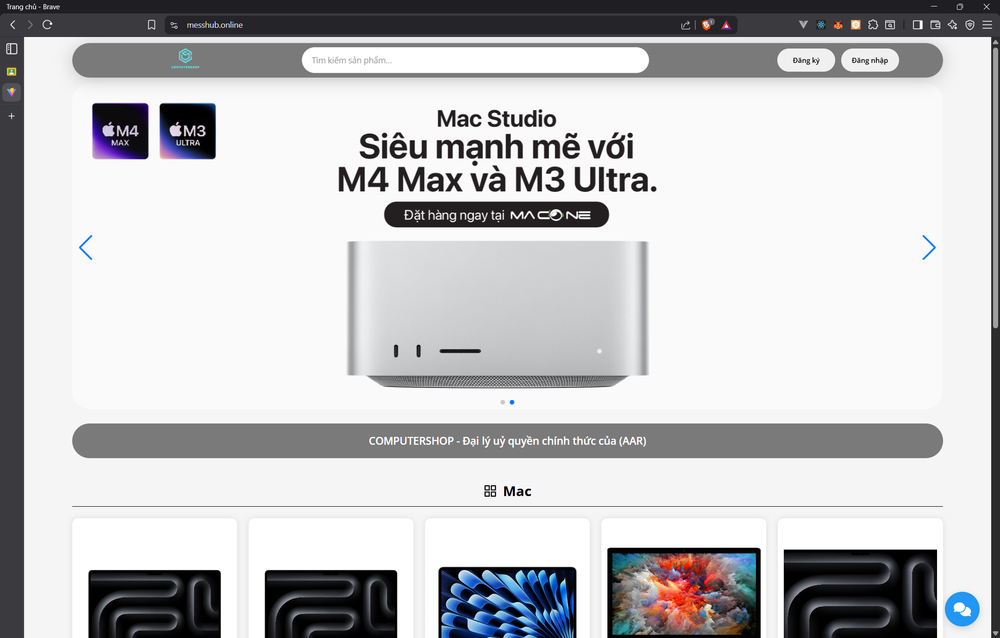
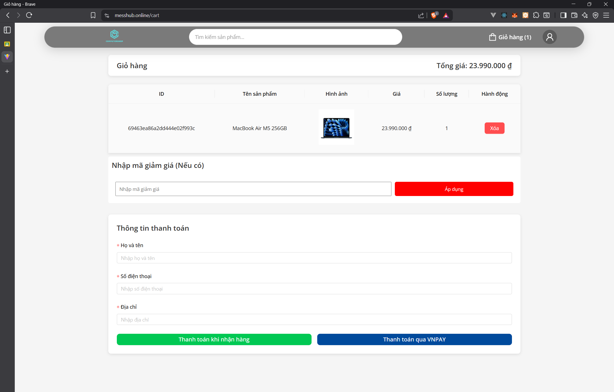
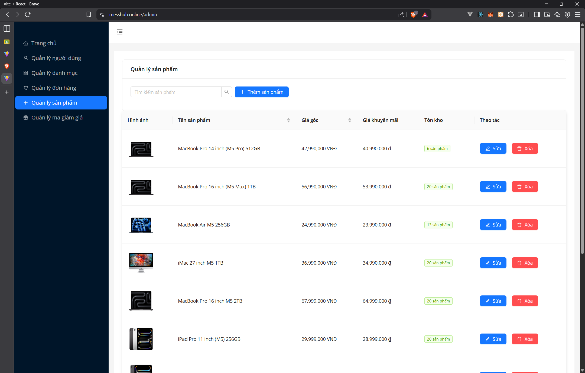

# Đồ Án Website Bán Điện Thoại

## 1. Giới thiệu tổng quan

Đây là dự án xây dựng một website thương mại điện tử chuyên kinh doanh các sản phẩm điện thoại di động. Hệ thống cung cấp đầy đủ các chức năng cần thiết cho một trang web bán hàng trực tuyến, bao gồm:

-   **Khách hàng**: Xem sản phẩm, tìm kiếm, lọc sản phẩm, quản lý giỏ hàng, đặt hàng, thanh toán trực tuyến (VNPAY), quản lý thông tin cá nhân, theo dõi đơn hàng.
-   **Quản trị viên (Admin)**: Quản lý sản phẩm, danh mục, đơn hàng, người dùng, mã giảm giá, xem thống kê doanh thu.
-   **Tính năng đặc biệt**: Chatbot hỗ trợ khách hàng (sử dụng Google Generative AI).

## 2. Danh sách thành viên nhóm

| STT | Họ và tên        | Mã sinh viên | Phân chia công việc |
| --- | ---------------- | ------------ | ------------------- |
| 1   | Nguyễn Như Huy   | 22810310216  | Deploy với code     |
| 2   | Nguyễn Đăng Mạnh | 228          | Phế vật             |
| 3   | Nguyễn Tuấn Phi  | 22810310215  | Code và làm báo cáo |

## 3. Video Demo

**Video demo *: [Google Drive - Video Demo](https://drive.google.com/file/d/1IkM0iKMp-eSilfIZUvqO5vzxTdbuHy0S/view?usp=sharing)

## 4. Công nghệ sử dụng

-   **Frontend**: ReactJS, Vite, Ant Design, SCSS, Axios.
-   **Backend**: Node.js, Express.js.
-   **Database**: MongoDB.
-   **Khác**: Docker, Nginx, VNPAY Payment, Google Generative AI.

## 4. Hướng dẫn cài đặt và sử dụng

### Yêu cầu môi trường

-   Node.js (v14 trở lên)
-   MongoDB (Local hoặc Atlas)
-   Git

### Thiết lập biến môi trường (.env)

Tạo file `.env` trong thư mục `server` và `client` (nếu cần) với các thông tin sau:

**Server (`server/.env`):**

**Server (`server/.env`):**

````env
PORT=3000
CONNECT_DB=mongodb+srv://... (Chuỗi kết nối MongoDB)
CLIENT_URL=http://localhost:5173

# Cấu hình bảo mật
SECRET_CRYPTO=your_secret_crypto_key

# Cấu hình Email (Google OAuth 2.0 cho Nodemailer)
USER_EMAIL=your_email@gmail.com
CLIENT_ID=your_google_client_id
CLIENT_SECRET=your_google_client_secret
REDIRECT_URI=https://developers.google.com/oauthplayground
REFRESH_TOKEN=your_google_refresh_token

# Google Gemini AI
API_KEY_GEMINI=your_gemini_api_key


**Client (`client/.env`):**

```env
VITE_API_URL=http://localhost:3000
VITE_SECRET_CRYPTO=your_secret_crypto_key (Phải trùng với SECRET_CRYPTO của Server)
VITE_CLIENT_ID=your_google_client_id (Dùng cho Google Login)
````

### Cài đặt và chạy dự án (Thủ công)

#### 1. Backend (Server)

```bash
cd server
npm install
npm run dev
```

Server sẽ chạy tại `http://localhost:3000`.

#### 2. Frontend (Client)

```bash
cd client
npm install
npm run dev
```

Client sẽ chạy tại `http://localhost:5173` (hoặc port khác tùy cấu hình Vite).

### Cài đặt và chạy bằng Docker

```bash
docker-compose up --build
```

Hệ thống sẽ khởi chạy các container cho Node.js server và Nginx (phục vụ frontend).

### Cấu hình cho VPS/Production

#### 1. Đổi Domain/Host

Mở file `nginx/default.conf` và thay đổi `server_name`:

```nginx
server_name your-domain.com www.your-domain.com;  # Thay bằng domain của bạn
```

#### 2. Cấu hình SSL

Copy certificate và key vào thư mục `nginx/ssl/`:

```bash
nginx/ssl/
  ├── your-domain.pem      # Certificate file
  └── your-domain.key      # Private key file
```

Sau đó cập nhật đường dẫn trong `nginx/default.conf`:

```nginx
ssl_certificate /etc/nginx/ssl/your-domain.pem;
ssl_certificate_key /etc/nginx/ssl/your-domain.key;
```

#### 3. Cập nhật biến môi trường

**Server (`server/.env`):**

```env
PORT=3000
CONNECT_DB=mongodb+srv://...                    # MongoDB connection string
CLIENT_URL=https://your-domain.com              # Frontend URL (Production)
SECRET_CRYPTO=your_secret_key
USER_EMAIL=your_email@gmail.com
# ... các biến khác giữ nguyên
```

**Client (`client/.env`):**

```env
VITE_API_URL=https://your-domain.com           # API URL (Production)
VITE_SECRET_CRYPTO=your_secret_key             # Trùng với server
VITE_CLIENT_ID=your_google_client_id
```

#### 4. Deploy

```bash
# Build client
cd client && npm install && npm run build && cd ..

# Chạy với Docker
docker-compose up -d --build
```

## 5. Tài khoản Demo

| Vai trò | Tài khoản (Email/Username) | Mật khẩu |
| ------- | -------------------------- | -------- |
| Admin   | admin@gmail.com            | 123456   |
| User    | user@gmail.com             | 123456   |

_(Lưu ý: Cập nhật thông tin tài khoản thực tế nếu khác)_

## 6. Một số hình ảnh kết quả

### Trang chủ



### Trang chi tiết sản phẩm


### Giỏ hàng & Thanh toán



### Trang quản trị (Admin)


